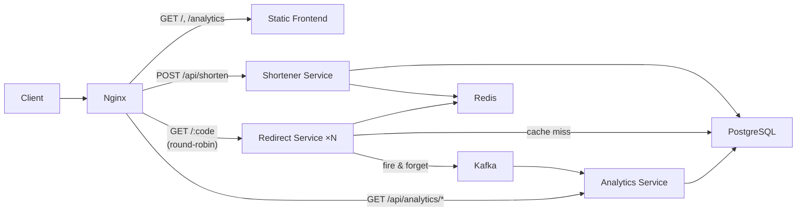

# Shortly — URL Shortener

A microservices URL shortener built with Go, designed to explore system design patterns: service decomposition, caching, async event pipelines, and horizontal scaling.

## Architecture



**Stack:** Go (chi) · PostgreSQL 15 · Redis 7 · Kafka · Nginx · React/TypeScript (Vite) · Docker Compose

## How to Run

```bash
docker compose up --build
```

Frontend at [http://localhost](http://localhost), analytics at [http://localhost/analytics](http://localhost/analytics).

To test horizontal scaling of the redirect service:

```bash
docker compose up --build --scale redirect-service=3
```

## API

**Shorten a URL**

```bash
curl -X POST http://localhost/api/shorten \
  -H "Content-Type: application/json" \
  -d '{"url": "https://example.com/very/long/path"}'
# {"short_url": "http://localhost/aB3x9Kz"}
```

**Redirect**

```bash
curl -o /dev/null -w "%{http_code}" http://localhost/aB3x9Kz
# 302
```

**Analytics**

```bash
curl http://localhost/api/analytics/aB3x9Kz
# {"short_code": "aB3x9Kz", "click_count": 5}
```

## Design Decisions

**Separate shortener and redirect services.** Writes (shortening) are rare; reads (redirects) are 99%+ of traffic. Splitting them lets the redirect service scale independently.

**Redis cache in front of PostgreSQL.** PostgreSQL handles ~10k reads/sec. At 10M DAU the system needs ~1,160 req/sec sustained and ~3,500 at peak. Redis absorbs the read load and keeps tail latencies low.

**Kafka for analytics.** Click events are published fire-and-forget from the redirect service. This decouples analytics writes from the hot redirect path — a brief Kafka outage means some lost click data, not failed redirects.

**302 redirects, not 301.** A 301 tells browsers to cache the redirect permanently, bypassing the server on future clicks. 302 ensures every click hits the redirect service so it can be tracked.

**No auto-increment IDs.** Sequential short codes are guessable (just increment to find other URLs) and create write contention on the sequence counter. Instead, codes are base62-encoded random values.

**Immutable URL cache with 24h TTL.** Short URL → original URL mappings never change, so there's no cache invalidation problem. A 24h TTL in Redis is safe and simple.

**`SELECT COUNT(*)` for analytics.** A deliberate scope trade-off. Production would use pre-aggregated counters or materialized views, but a simple count query keeps the implementation straightforward.

**Single Kafka partition.** On a single machine there's no benefit to multiple partitions. One partition gives ordered delivery with zero coordination overhead.

## Back-of-Envelope Math

| Metric | Value |
|---|---|
| Daily active users | 10M |
| Redirects per user per day | 10 |
| Total redirects/day | 100M |
| Average throughput | 100M / 86,400 ≈ **1,160 req/sec** |
| Peak throughput (3× spike) | **~3,500 req/sec** |
| Redirect service capacity | ~1,000–1,500 req/sec per replica |
| Replicas needed for peak | 3 (covers 3,500 with headroom) |
| Storage (10M users × 5 URLs × 500B) | ~25 GB over time |

## Load Testing

The k6 script (`scripts/load-test.js`) ramps from 100 to 1,160 req/sec (sustained average), then bursts to 3,500 req/sec (peak), then cools down.

Run via Docker:

```bash
docker run --rm -i \
  --network shortly_url-shortener-net \
  -v ./scripts:/scripts \
  grafana/k6 run /scripts/load-test.js
```